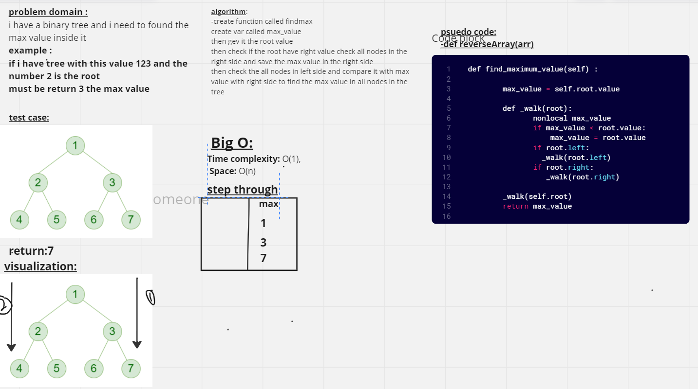

# Binary Tree and BST
add the node to the tree 
and search if the value exist in the tree node 
and travers the value for all type in the depth first 
## Approach & Efficiency
big O of Time O(n)
big of space O(n)
## Solution
python Binary_Tree_and_BST.py
[Test](./test/test.py)
pytest test.py
## White bord for find the max value
