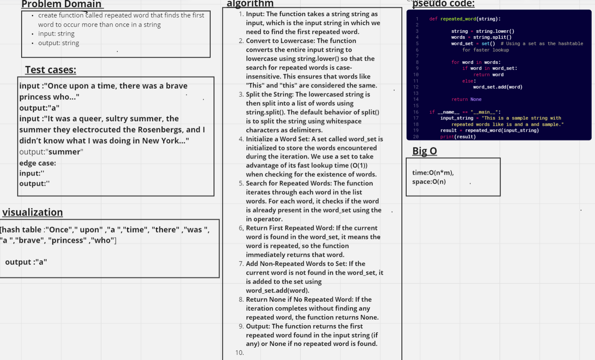

# hashmap_repeated_word
 function called repeated word that finds the first word to occur more than once in a string
Arguments: string
Return: string
## Whiteboard Process

## Approach & Efficiency
 the time complexity of the function is O(n + m), and the space complexity is O(n + m), 
## Solution
python hashmap_repeated_word.py 