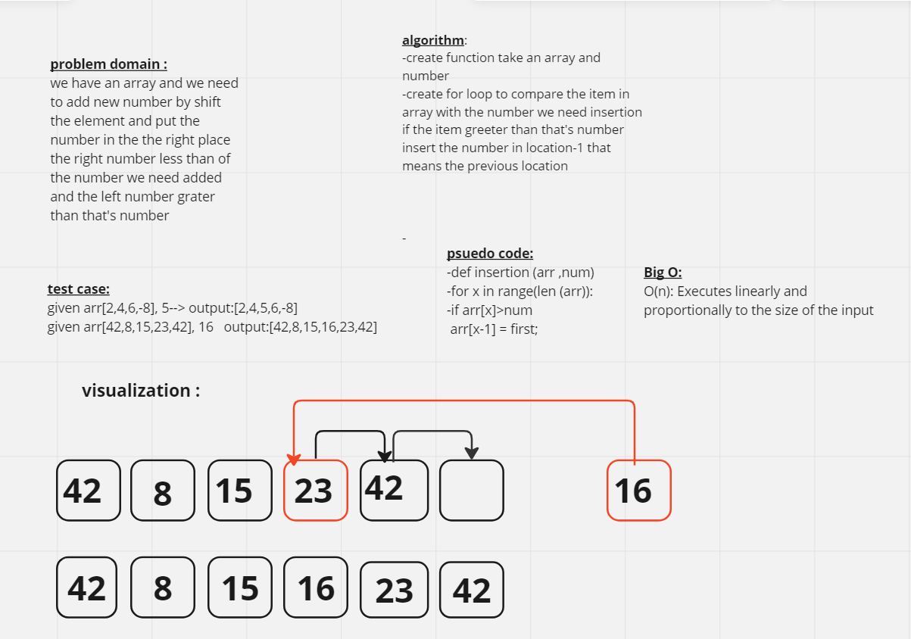

# Array insert shift
<!-- Description of the challenge -->
we have an array and we need to add new number by shift the element and put the number in the the right place  the right number less than of the number we need added and the left number grater than that's number

## Whiteboard Process

## Approach & Efficiency
<!-- What approach did you take? Why? What is the Big O space/time for this approach? -->
**Bgg O:**
O(n): Executes linearly and proportionally to the size of the input

## Solution
<!-- Show how to run your code, and examples of it in action -->
python Array_insert.py